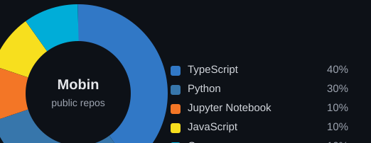

### 👋 Mobin

CS undergrad at **Shahid Beheshti University**, building AI-powered products that
solve real problems. Into **LLMs & agents**, **backend / system design**, and
learning the "why" before the tool — not the other way around.

---

**What I'm building**

- [**Celestial Desk** `planner`](https://github.com/fermow/planner) — self-hosted
  productivity suite, Starry-Night UI, one-command Docker deploy.
- [**PPR**](https://github.com/fermow/PPR) — fraud detection on transaction
  graphs via Personalized PageRank, with a custom power-iteration engine + React
  dashboard.
- [**Learning ML by Building**](https://github.com/fermow/learning-ml-by-building)
  — implementing ML from scratch, guided by failing tests.
- **Konkur AI** — Iranian-exam counseling platform (role-based dashboards,
  realtime alerts, live chat).

Other repos live private; ask me about them.

**Research mode:** multi-LLM gatekeeper agents, on *Zork*
([`llm_table`](https://github.com/fermow/llm_table),
[`zork_research`](https://github.com/fermow/zork_research)).

---

**Stack:** TypeScript · React · Node · Python · FastAPI · PostgreSQL · Docker ·
Go · LangGraph. Self-hosting & clean deploy mindset.

**Also into:** math, algorithms, computer architecture — and lately the messy,
hopeful edge of AI in health / bioinformatics.

**Language breakdown** (public repos, updated automatically):



---

Reach me at [mobinabedian6@gmail.com](mailto:mobinabedian6@gmail.com) — or find
me in Tehran.
```